<div align="center">

# MP Frontend

**A contract-driven frontend foundation for React and Next.js product teams.**

Build product frontends from reviewed API and design contracts without surrendering runtime security,
product ownership, or human review to generators or AI agents.

[](https://github.com/panahister/mpfrontend/actions/workflows/ci.yml)
[](LICENSE)
[](.node-version)
[](package.json)
[](#maturity-and-scope)

[Start here](#choose-your-starting-point) ·
[Conventions](docs/FRONTEND-CONVENTIONS.md) ·
[Architecture](#architecture) ·
[Packages](#package-catalog) ·
[Design systems](#design-system-workflow) ·
[AI procedures](#governed-ai-engineering) ·
[Security](#security-model) ·
[Evidence](#verification-and-evidence) ·
[FAQ](#frequently-asked-questions) ·
[MP ecosystem](https://github.com/panahister/mp-platform)

</div>

<picture>
  <source media="(prefers-color-scheme: dark)" srcset="docs/images/ecosystem-dark.svg">
  <source media="(prefers-color-scheme: light)" srcset="docs/images/ecosystem-light.svg">
  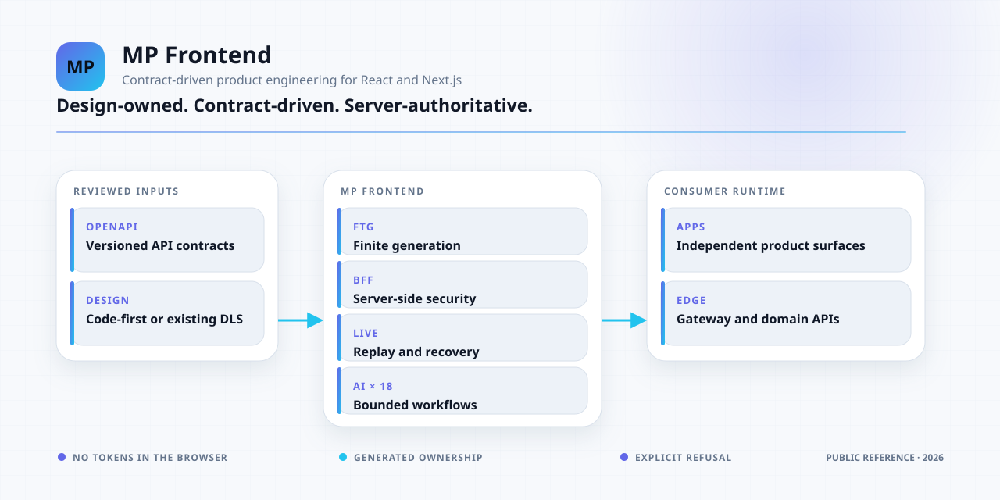
</picture>

> [!IMPORTANT]
> MP Frontend is currently a verified **public source proof of concept**. Its fourteen packages are not
> published to a package registry, and no stable public API guarantee is declared yet. The supported
> evaluation path is this source repository plus the immutable, hash-checked cohort in the
> [Tiffin reference](https://github.com/panahister/mpfrontend-tiffin-reference). See
> [Maturity and scope](#maturity-and-scope) before choosing it for production.

## What MP Frontend is

MP Frontend is a pnpm/Nx foundation for teams that need more than a component library but do not want a
framework to own their product. It provides a governed path from reviewed contracts to a secure,
internationalized, realtime-capable frontend while keeping business behavior, brand expression, and
deployment policy in the consumer repository.

The foundation has three responsibilities:

1. **Deterministic tooling** — scaffold workspaces, normalize selected OpenAPI profiles, generate finite
   models and validators, attach an optional consumer-owned design contract, and detect drift.
2. **Reusable runtime boundaries** — provide product-neutral UI primitives, server-side presentation,
   OIDC session handling, access-state fences, internationalization, and realtime recovery mechanics.
3. **Governed engineering procedures** — install a finite set of repository-scoped Codex and Claude Code
   workflows that use the same CLI, ownership rules, refusal behavior, and review gates as a developer.

It is deliberately **not** a SaaS platform, hosted design service, low-code screen builder, arbitrary
OpenAPI interpreter, backend authorization system, or replacement for product engineering judgment.

## The problem it solves

Frontend platforms usually become fragile at the boundaries: API schemas drift, generated files collide
with authored code, tokens leak into the browser, reconnects restore stale state, design files become an
untracked second source of truth, and AI agents invent a different architecture in every task.

MP Frontend makes those boundaries explicit:

| Product risk | MP Frontend response |
|---|---|
| Backend contracts and UI assumptions diverge | Capture reviewed OpenAPI inputs and generate only supported, finite TypeScript contracts |
| A generator overwrites product work | Separate generated ownership from handwritten adapters and refuse unexpected collisions or drift |
| Provider tokens or internal URLs reach browser code | Keep OIDC tokens and upstream routing in the Security BFF and presentation server |
| Client-side roles are mistaken for authorization | Treat UI access rules as presentation only; gateway and domain services remain authoritative |
| Realtime recovery publishes stale data | Bind tickets, authority revision, replay, snapshots, quotas, and revocation to explicit server contracts |
| Every team has a different design starting point | Support code-first products and reviewed exports from any consumer-owned DLS |
| A private Figma library leaks into a public codebase | Store only the consumer-approved local contract; never fetch, mutate, or publish the source design |
| AI agents improvise architecture or bypass gates | Install finite procedures that call deterministic tooling and preserve human approval boundaries |
| A green unit test is presented as production readiness | Record scoped evidence and name every unproved deployment, security, and accessibility gate |

## Choose your starting point

| Your situation | Recommended path |
|---|---|
| You want to understand the complete ecosystem | Start with [MP Platform](https://github.com/panahister/mp-platform), then return to this repository for frontend internals |
| You want to evaluate the foundation source | Follow [Verify the repository](#verify-the-repository) |
| You want to see a real product using it | Run the [Tiffin frontend reference](https://github.com/panahister/mpfrontend-tiffin-reference) with the [Tiffin backend](https://github.com/panahister/mpcore-tiffin-sample) |
| Your product has no existing design system | Initialize with design source `none`; own tokens and composition in your product repository |
| Your product already has a Figma file or DLS | Initialize with `existing`; attach a reviewed normalized export without changing or publishing the source file |
| You want AI assistance | Install the Base or Design procedure profile into the consumer repository; keep the same human review gates |
| You need a stable registry package today | Wait for the registry and compatibility release gates; package names in this source are currently prerelease and unpublished |

For a guided source walkthrough, read [Getting started](docs/GETTING-STARTED.md). For the exact current
capability and limitation matrix, read [Implementation status](docs/IMPLEMENTATION-STATUS.md).

## See the reference product running

The diagrams describe the platform; these are the actual public Tiffin reference surfaces running
against its gateway, identity, media, and food-delivery services. The screenshots contain only public
demo content and empty authentication fields.

<table>
  <tr>
    <td width="50%" valign="top">
      <a href="docs/showcase/tiffin-customer.png">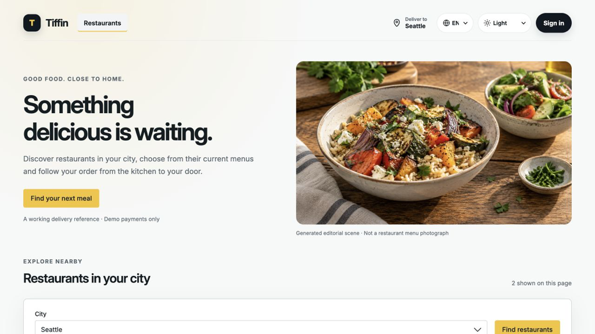</a>
      <br><strong>Customer discovery</strong><br>
      Responsive product chrome, city context, locale and appearance controls, and an anonymous discovery
      journey backed by the public reference application.
    </td>
    <td width="50%" valign="top">
      <a href="docs/showcase/tiffin-catalog.png">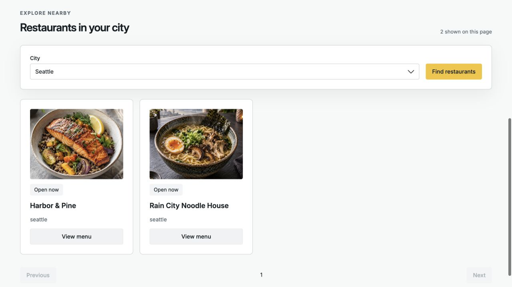</a>
      <br><strong>Live catalog data and media</strong><br>
      US-only demo data, city-scoped discovery, restaurant availability, and provenance-tracked restaurant
      images served through the implemented Media boundary.
    </td>
  </tr>
  <tr>
    <td width="50%" valign="top">
      <a href="docs/showcase/tiffin-operations.png">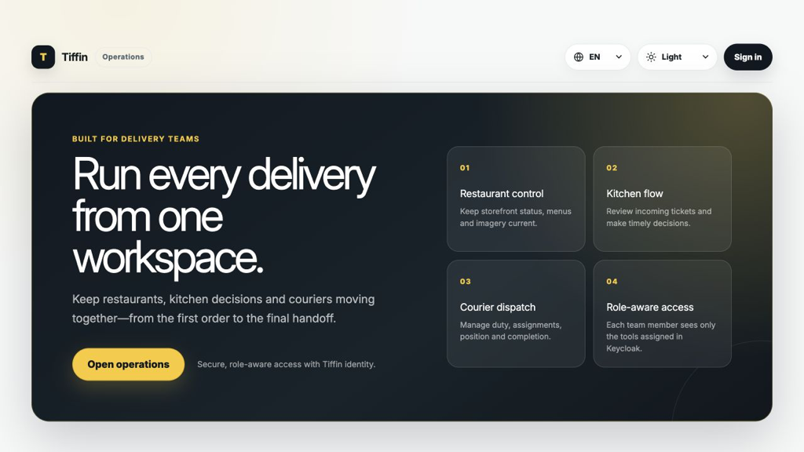</a>
      <br><strong>Operations workspace</strong><br>
      One role-aware entry point for restaurant control, kitchen decisions, courier dispatch, and
      Keycloak-backed capability boundaries.
    </td>
    <td width="50%" valign="top">
      <a href="docs/showcase/tiffin-identity.png">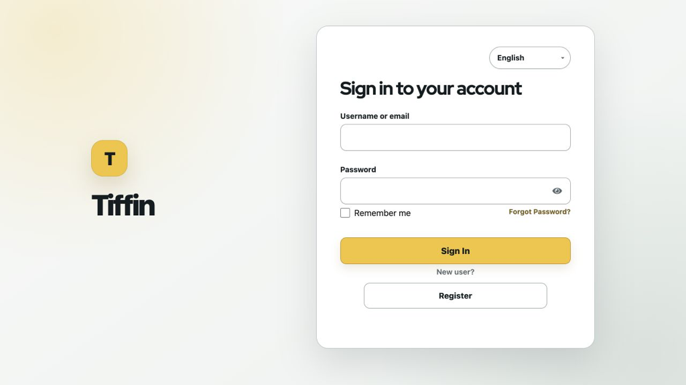</a>
      <br><strong>Product-owned identity experience</strong><br>
      A custom Keycloak theme for sign-in, registration, recovery, locale handoff, and the OIDC boundary;
      seeded roles and resources are exercised by the reference scenario suite.
    </td>
  </tr>
</table>

### Identity is not a mocked login

The reference identity layer seeds **five business roles, eight resources, sixteen scopes, and twenty
role/resource permissions**. Keycloak remains the credential source of truth; Tiffin receives durable
user-lifecycle events and keeps an idempotent, credential-free business projection keyed by the immutable
Keycloak subject.

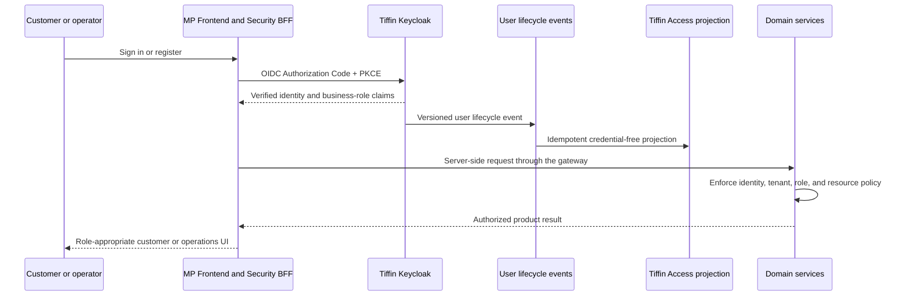

| Seeded role | Reference responsibility |
|---|---|
| `customer` | Browse, place or cancel own orders, track delivery, and manage own notifications |
| `restaurant-manager` | Manage one restaurant's catalog and media and operate its kitchen queue |
| `courier` | Participate in dispatch and report delivery position |
| `city-admin` | Govern city-scoped business identities and role decisions |
| `platform-admin` | Govern cross-city identity and authorization state |

Tiffin owns its visual theme and food-delivery composition. MP Frontend supplies the contracts,
runtime boundaries, and verification model that let a consumer build a distinct product rather than a
rebranded template. Image provenance and exact digests are recorded in
[the showcase manifest](docs/showcase/README.md).

## Architecture

MP Frontend separates a **build-time contract plane** from a **runtime trust plane**. Build tooling may
produce owned artifacts; it never becomes runtime authority. Browser code may shape the user experience;
it never becomes the policy decision point.

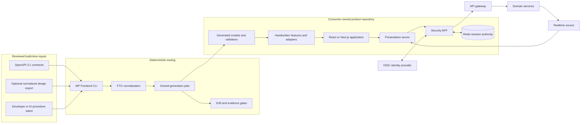

### Architectural invariants

- **The consumer owns the product.** Screens, workflows, domain language, product policy, brand assets,
  fonts, icons, and deployment configuration stay outside the reusable foundation.
- **The server owns authority.** Browser visibility and capability rules improve UX; they never authorize
  an API request.
- **Tokens stay out of browser JavaScript.** The BFF retains provider credentials and exposes only an
  opaque, origin-bound application session.
- **Generation is finite.** Unsupported contract shapes fail explicitly instead of being approximated.
- **Authored code is not generator output.** Owned generated paths, manifests, locks, and hashes protect
  handwritten files from accidental replacement.
- **Design integration is local and consumer-controlled.** MP Frontend does not call Figma, scrape a file,
  publish a library, or imply redistribution rights.
- **Failure is part of the contract.** Session-store uncertainty fails closed; stale authority cannot
  publish a refreshed session; realtime recovery is bounded.
- **AI follows the same rules.** Procedures sequence reviewed tools; they do not gain extra permissions or
  bypass an unsupported profile.
- **Evidence is scoped.** A passing source gate proves that gate, not production HA, security approval,
  accessibility certification, or every consumer deployment.

Read [Architecture](docs/ARCHITECTURE.md) for trust boundaries, failure behavior, package dependency
direction, design lifecycle, deployment model, and non-goals.

## From contract to product

The normal delivery loop keeps generated and authored responsibilities visible:

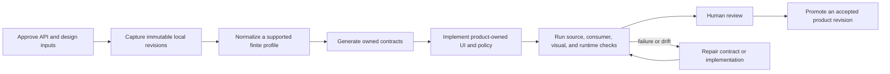

### Generated versus product-owned

| Foundation/tooling may own | Consumer product must own |
|---|---|
| Normalized contract metadata | Business language and domain decisions |
| TypeScript request/read models | Feature composition and interaction design |
| Standalone runtime validators | Product routes and workflow orchestration |
| Selected presentation readers and mutation adapters | Brand tokens, assets, fonts, icons, and visual acceptance |
| Generated token CSS and component metadata for an accepted design plan | React component adapters and component behavior tests |
| Manifests, hashes, plans, and ownership receipts | Deployment topology, secrets, observability, and production acceptance |

The generator does not turn an arbitrary API or Figma file into a finished application. It creates a
reviewable contract surface so product engineers can implement the behavior that only the product owns.

## Capability map

| Capability | What exists today | Boundary |
|---|---|---|
| Workspace scaffolding | New pnpm/Nx workspace, application, feature, route, and shared-package generators with explicit design-source mode; see the [CLI guide](docs/CLI-GUIDE.md) | Refuses existing or symlink destinations; does not install dependencies, initialize Git, or deploy |
| Workspace quality profile | Shared formatter, lint and TypeScript configuration; module boundaries, raw-colour and hand-written-CSS rules; a workspace `check` and a CI-neutral gate | Rules cover literals and stylesheets, not colours computed at run time |
| OpenAPI integration | Selected OpenAPI 3.1 reads and mutations, types, field metadata, standalone validators, and presentation adapters | Finite profiles only; unsupported ambiguity fails |
| UI foundation | Product-neutral interaction primitives, semantic tokens, Tailwind v4 integration, composable React UI, and a shared application frame | No product theme, icons, typography, or screen ownership |
| Internationalization | Locale negotiation and direction-aware English/Arabic foundations | Product copy and complete locale QA remain consumer responsibilities |
| Access presentation | Capability, field, and record visibility plus stale-authority fences | Not backend authorization |
| OIDC session boundary | Authorization Code + PKCE, opaque cookies, Redis-backed encrypted records, refresh coordination, revocation, CSRF and allowlists | Current package refuses production startup pending production security gates |
| Realtime | Single-use tickets, bounded admission, reconnect, replay/snapshot coordination, revocation, and diagnostics | Current presentation relay is a validation profile, not a durable production event bus |
| Design synchronization | Code-first `none` and consumer-owned `existing`, immutable candidates, diff/plan/apply/accept/check | No Figma API, extractor, watcher, Community library, or automatic React implementation |
| AI procedures | Fourteen Base and four Design procedures for Codex and Claude Code | Format and workflow evidence do not guarantee identical model decisions |
| Distribution verification | Fourteen archives, manifest and digest checks, negative controls, and a fresh independent consumer | Registry publication and stable compatibility are not shipped |

## OpenAPI contract generation

FTG treats request and response semantics as explicit profiles rather than guessing from route names or
UI conventions.

### Supported finite profiles

| Contract | Supported behavior |
|---|---|
| JSON reads | Selected `200`, `201`, or `202` finite object/array responses with generated types and standalone validators |
| Empty response | Explicit `204` with no content and an `undefined`-only reader |
| Required JSON request | Required, finite, closed object body with read-only exclusion and write-only input support |
| Optional JSON request | Present but non-required finite closed object, preserving absence, `null` when declared, and object as distinct values |
| Bodyless request | Explicit absence of `requestBody`; any supplied payload is rejected, including `null` or `{}` |
| Field metadata | Selected finite fields for tables/forms without truncating the full runtime response reader |

Recursive models, unsupported composition, mixed fixed/dictionary shapes, arbitrary multipart, inferred
widgets, unspecified response bodies, and product business rules are refused rather than silently
weakened. See [Generated reads](docs/R4-GENERATED-READS.md) and
[Generated requests](docs/R4-GENERATED-REQUESTS.md).

## Design system workflow

MP Frontend supports products **with or without** an existing design system. It does not require a public
MP Frontend Figma library.

| Mode | Use it when | Initial state |
|---|---|---|
| `none` | The product is code-first or will introduce a design contract later | `disabled` and immediately usable |
| `existing` | The team already owns an approved private or public Figma/DLS source | `pending` until a reviewed local binding is attached |

The former public-template mode is deliberately refused because no MP Frontend Community DLS ships in
this MVP.

```bash
# Code-first product
mpfrontend init --name acme-portal --directory ./acme-portal \
  --design-source none --json

# Product with its own approved design system
mpfrontend init --name acme-portal --directory ./acme-portal \
  --design-source existing --json
mpfrontend design attach --directory ./acme-portal --source existing \
  --binding ./design.binding.json --dry-run --json
mpfrontend design attach --directory ./acme-portal --source existing \
  --binding ./design.binding.json --json
mpfrontend design status --directory ./acme-portal --json
```

### What happens to an existing Figma/DLS

```mermaid
flowchart LR
  FIGMA[Consumer-owned Figma or DLS] --> EXPORT[Reviewed normalized local export]
  EXPORT --> IMPORT[Immutable candidate]
  IMPORT --> DIFF[Validate and diff]
  DIFF --> PLAN[Review bound plan]
  PLAN --> APPLY[Apply owned token and metadata outputs]
  APPLY --> ADAPTERS[Implement product component adapters and tests]
  ADAPTERS --> EVIDENCE[Attach visual, RTL, keyboard, contrast, and unit evidence]
  EVIDENCE --> ACCEPT[Human-reviewed acceptance]
  ACCEPT --> CHECK[Continuous drift check]
```

The CLI can generate owned token CSS and component metadata. It does **not** generate a finished React
component library, judge screenshots, run Figma, grant asset rights, or accept a baseline on behalf of a
reviewer. Private bindings, raw exports, evidence, and licensed assets remain in the consumer repository
under that team's publication policy.

The complete lifecycle is documented in
[Reviewed export synchronization](packages/ftg-cli/DESIGN-SYNC.md).

## Governed AI engineering

`@mpfrontend/ai-skills` installs one canonical procedure catalog into repository-local discovery paths:
`.agents/skills/` for Codex and `.claude/skills/` for Claude Code. It never writes personal/global agent
configuration and never runs from package post-install.

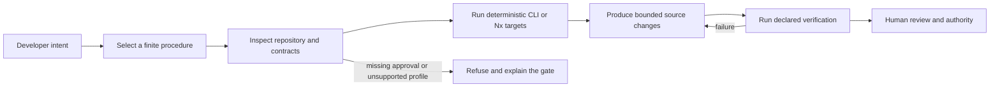

### Base profile: fourteen procedures

| Area | Procedures |
|---|---|
| Start and evolve | `mpfrontend-scaffold-app`, `mpfrontend-implement-feature`, `mpfrontend-upgrade-project`, `mpfrontend-prepare-release` |
| API and data UX | `mpfrontend-integrate-openapi`, `mpfrontend-form-from-api`, `mpfrontend-table-from-api` |
| Identity and authority | `mpfrontend-integrate-auth`, `mpfrontend-apply-access` |
| Runtime behavior | `mpfrontend-integrate-realtime`, `mpfrontend-configure-i18n`, `mpfrontend-configure-theme` |
| UI and evidence | `mpfrontend-use-ui`, `mpfrontend-verify-frontend` |

### Design profile: four additional procedures

- `mpfrontend-import-design-system`
- `mpfrontend-sync-design-tokens`
- `mpfrontend-reconcile-design-components`
- `mpfrontend-review-design-drift`

```bash
mpfrontend skills list --json
mpfrontend skills install --directory ./acme-portal --for both \
  --profile base --dry-run --json
mpfrontend skills install --directory ./acme-portal --for both \
  --profile base --json
mpfrontend skills check --directory ./acme-portal --json
```

Use `--profile design` when the repository needs all eighteen procedures. Installation is idempotent,
lock-protected, and refuses conflicting, partially owned, or locally modified procedure files. AI agents
receive no deployment credentials, design rights, or approval authority from these files. Read the
[AI skills package](packages/ai-skills/README.md) for ownership and recovery behavior.

## Security model

The runtime follows a BFF model: browser JavaScript never receives provider access or refresh tokens.

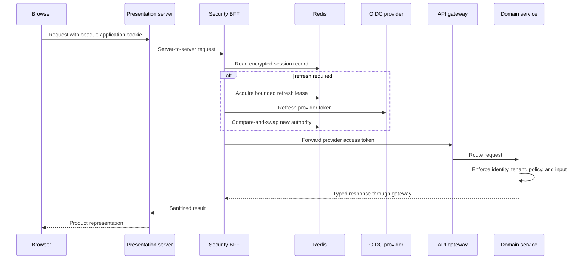

Implemented validation-profile controls include:

- OIDC Authorization Code with S256 PKCE, state, nonce, RS256 JWT/JWKS validation, and single-use login state.
- Opaque `HttpOnly` cookies, same-origin and CSRF checks, method/endpoint/role allowlists, and bounded bodies.
- AES-256-GCM Redis session records, hashed session keys, key identifiers, bounded refresh leases, atomic
  compare-and-swap, revocation protection, absolute expiry, and fail-closed storage behavior.
- Authority fences that stop stale browser work from publishing after identity, tenant, role revision, or
  session authority changes.
- Realtime tickets bound to the opaque session and authority revision, bounded connection/subscription
  limits, snapshot recovery, stale-authority rejection, and privacy-minimal diagnostics.

The current packages intentionally refuse production startup. Production TLS, secrets and key custody,
HA Redis policy, regional failure behavior, global realtime quotas, load evidence, and independent
security review remain deployment gates. Read [Security BFF](packages/security-bff/README.md),
[Shared runtime](docs/R2-SHARED-RUNTIME.md), and [Security policy](SECURITY.md).

## Package catalog

The workspace contains fourteen domain-neutral packages:

| Package | Runtime | Responsibility |
|---|---|---|
| [`@mpfrontend/ftg-cli`](packages/ftg-cli) | Tooling | Workspace lifecycle, design-source commands, contract generation, verification, and skills installation |
| [`@mpfrontend/nx-plugin`](packages/nx-plugin) | Tooling | Repeatable Nx workspace/application generators and project wiring |
| [`@mpfrontend/ftg-core`](packages/ftg-core) | Universal | Finite OpenAPI normalization and request/response metadata |
| [`@mpfrontend/ai-skills`](packages/ai-skills) | Tooling | Eighteen repository-scoped Codex and Claude Code engineering procedures |
| [`@mpfrontend/workspace-config`](packages/workspace-config) | Tooling | Shared ESLint, Prettier and TypeScript profile with module-boundary, raw-colour and hand-written-CSS rules |
| [`@mpfrontend/primitives`](packages/primitives) | Universal | Pure product-neutral interaction and accessibility state contracts |
| [`@mpfrontend/tokens`](packages/tokens) | Universal | Semantic token types and product-theme boundaries |
| [`@mpfrontend/i18n`](packages/i18n) | Universal | Locale negotiation and direction-aware foundations |
| [`@mpfrontend/access-core`](packages/access-core) | Universal | Presentation capabilities, field/record visibility, and authority fences |
| [`@mpfrontend/ui`](packages/ui) | Client | Token-driven React composition plus Tailwind v4 integration |
| [`@mpfrontend/app-layout`](packages/app-layout) | Universal | Server-safe, direction-aware application frame: skip link, header, navigation slot, and page frame |
| [`@mpfrontend/presentation-server`](packages/presentation-server) | Server | Authenticated API mediation and bounded realtime presentation transport |
| [`@mpfrontend/security-bff`](packages/security-bff) | Server | OIDC lifecycle, opaque sessions, encrypted Redis records, refresh coordination, and revocation |
| [`@mpfrontend/realtime-core`](packages/realtime-core) | Universal | Ticket admission, reconnect, replay/snapshot recovery, revocation, and diagnostics |

Packages are modular, but the current public distribution proof validates them as one locked cohort. Do
not install an unpublished package name from an arbitrary registry.

## Verify the repository

### Prerequisites

- Git
- Node.js `24.19.0`
- pnpm `11.25.0`
- Docker for Redis-backed integration scenarios

Pinned tool versions are part of the reproducibility contract.

```bash
git clone https://github.com/panahister/mpfrontend.git
cd mpfrontend
npm install --global pnpm@11.25.0
pnpm install --frozen-lockfile
pnpm check --skip-nx-cache
```

`pnpm check` runs the public-boundary verifier plus lint, type checking, tests, and builds across the Nx
workspace. `--skip-nx-cache` proves the current source instead of replaying earlier output.

Prove the package boundary and a fresh independent consumer:

```bash
pnpm pack:local
pnpm exec nx run distribution:consumer-check
```

Run the Redis-backed session profile and deliberate negative controls:

```bash
pnpm exec nx run security-bff:test-redis --skip-nx-cache
pnpm exec nx run distribution:negative-controls --skip-nx-cache
```

The negative controls intentionally remove required guards and pass only when the expected tests fail.
Generated archives and temporary consumers are verification output, not published releases.

## Verification and evidence

The published source checkpoint currently records:

| Evidence | Observed result |
|---|---:|
| Complete Nx workspace | 56/56 uncached lint, typecheck, test, and build targets |
| Package cohort | 14/14 archives, manifests, digests, and export checks |
| Distribution negative controls | 10/10 expected failures observed |
| AI procedure format validation | 18/18 procedures |
| Installed independent-consumer security assertions | 12/12 |
| Installed independent-consumer realtime assertions | 5/5 |
| Tiffin reference gate | 19/19 lint, typecheck, test, build, generated-contract, and design checks |
| Current public CI | [GitHub Actions run 37697781045](https://github.com/panahister/mpfrontend/actions/runs/37697781045) passed |

These counts are scoped engineering evidence, not a readiness percentage. The exact package versions,
fixture boundaries, and remaining gates are maintained in
[Implementation status](docs/IMPLEMENTATION-STATUS.md).

## Reference implementation

[MP Frontend Tiffin Reference](https://github.com/panahister/mpfrontend-tiffin-reference) is the selected
public end-to-end consumer. It uses an independently authored public theme and contains no private Figma
key, export, binding, or design provenance.

Together with the [Tiffin backend](https://github.com/panahister/mpcore-tiffin-sample),
[Tiffin Keycloak](https://github.com/panahister/tiffin-keycloak), and
[Tiffin APISIX](https://github.com/panahister/tiffin-apisix), it exercises:

- Anonymous restaurant and menu discovery with real media.
- OIDC login, registration, recovery, and Keycloak-owned customer identity.
- Customer ordering, payment outcomes, kitchen decisions, courier dispatch, tracking, delivery, and
  notifications.
- Role-aware restaurant, courier, city, and platform boundaries.
- English and Arabic, LTR and RTL, light/dark/system theming, customer and operations surfaces.
- Positive journeys, failure behavior, idempotency, stale authority, outage, and generated-contract gates.

The reference proves the selected product scenario. It does not convert every package or topology into a
production-certified platform.

## Repository structure

```text
.
├── packages/
│   ├── ftg-cli/               workspace, design, generation, and skills commands
│   ├── nx-plugin/             deterministic Nx generators
│   ├── ftg-core/              finite API contract normalization
│   ├── ai-skills/             canonical repository-scoped AI procedures
│   ├── workspace-config/      shared formatter, lint and TypeScript profile
│   ├── primitives/            pure interaction and accessibility state
│   ├── tokens/                semantic design-token boundaries
│   ├── i18n/                  locale and direction foundations
│   ├── access-core/           presentation access and authority fences
│   ├── ui/                    React/Tailwind composition
│   ├── app-layout/            application frame, header, navigation, and page frame
│   ├── presentation-server/   server mediation and realtime transport
│   ├── security-bff/          OIDC and encrypted session authority
│   └── realtime-core/         client admission and recovery
├── tools/distribution/        pack, independent-consumer, and negative-control gates
├── docs/                      architecture, decisions, evidence, and runtime contracts
└── .github/workflows/         verification-only CI; no publish or deployment credentials
```

## Maturity and scope

### Implemented and verified in this source release

- Deterministic workspace/application scaffolding.
- Selected finite OpenAPI read and mutation profiles.
- Generated ownership, preservation, drift, and negative controls.
- Product-neutral UI, token, i18n, access, server, session, and realtime foundations.
- Code-first and consumer-owned design-source workflows.
- Eighteen finite repository-scoped AI procedures.
- Packed-cohort and independent-consumer verification.
- A real Tiffin product reference with backend, gateway, identity, media, and role scenarios.

### Not shipped or not claimed

- npm or another package-registry release.
- Stable semantic-version compatibility guarantees.
- A public MP Frontend Figma Community library.
- Automatic Figma extraction, watching, mutation, or publication.
- Arbitrary OpenAPI support or automatic screen generation.
- Production HA, TLS/key custody, multi-region failover, or load qualification.
- Formal accessibility certification across a complete product matrix.
- Independent production security approval.

The project chooses explicit refusal over a misleading fallback when a profile, permission, artifact, or
piece of evidence is missing.

## Frequently asked questions

<details>
<summary><strong>Is MP Frontend ready for production?</strong></summary>

Not as a general production-certified platform. The source, package boundary, independent consumer, and
Tiffin reference are verified. Registry stability, production HA/TLS/key custody, load qualification,
formal accessibility acceptance, and independent security review remain separate gates.
</details>

<details>
<summary><strong>Can I install the packages from npm?</strong></summary>

No official registry release exists yet. The public evaluation path uses this source and the vendored,
hash-checked package cohort in the Tiffin reference. Do not trust an arbitrary registry package using
these names.
</details>

<details>
<summary><strong>Do I need Figma or a design system?</strong></summary>

No. Choose design source `none` for a code-first product. If your team already owns an approved Figma or
DLS, choose `existing` and attach a reviewed normalized local export.
</details>

<details>
<summary><strong>Does MP Frontend connect directly to Figma?</strong></summary>

No. It does not request Figma credentials, call the Figma API, scrape nodes, mutate a file, or publish a
library. The consumer supplies and owns the normalized local contract and all distribution rights.
</details>

<details>
<summary><strong>Will the CLI implement my Figma components automatically?</strong></summary>

No. The current design lifecycle can validate mappings, generate owned token CSS and component metadata,
create implementation tasks, and verify reviewed evidence. Product engineers still implement and review
React adapters, behavior, visual fidelity, accessibility, and product composition.
</details>

<details>
<summary><strong>Will it generate an application from any OpenAPI document?</strong></summary>

No. FTG supports explicitly selected finite OpenAPI 3.1 profiles. Unsupported recursive, composed,
ambiguous, multipart, or product-semantic cases fail instead of producing unsafe approximations.
</details>

<details>
<summary><strong>Does client-side access control secure the backend?</strong></summary>

No. Access rules in the frontend are presentation projections. The gateway and every domain service must
validate the token, tenant, policy, and input independently.
</details>

<details>
<summary><strong>What do the AI procedures actually do?</strong></summary>

They give Codex and Claude Code the same finite repository workflows for scaffolding, features, APIs,
auth, access, realtime, i18n, theming, verification, upgrades, releases, and optional design lifecycle
tasks. They call deterministic tooling and preserve repository ownership and human approval. They do not
grant credentials, approve a design, publish a release, or guarantee identical decisions across models.
</details>

<details>
<summary><strong>Can I use only one package?</strong></summary>

The packages are intentionally modular and have explicit runtime roles. However, the current public
distribution evidence validates one locked fourteen-package cohort, and no registry API stability contract
exists yet. Evaluate isolated adoption against the package's documented boundary and your own tests.
</details>

<details>
<summary><strong>Is MP Frontend tied to the MP Core backend?</strong></summary>

No. MP Frontend consumes explicit HTTP/OIDC/realtime contracts and can be evaluated independently. The
Tiffin reference uses MP Core because it provides the ecosystem's complete real-world proof, not because
the frontend packages import backend framework code.
</details>

<details>
<summary><strong>What remains in my product repository?</strong></summary>

All product decisions: business workflows, copy, routes, brand and design assets, component adapters,
authorization policy on the backend, API selection, environment configuration, secrets, observability,
deployment, visual acceptance, accessibility acceptance, and release approval.
</details>

## Documentation map

| Document | Use it for |
|---|---|
| [Getting started](docs/GETTING-STARTED.md) | Toolchain setup, source verification, package proof, and evaluation path |
| [Frontend conventions](docs/FRONTEND-CONVENTIONS.md) | Placement rules, separation of concerns, API-to-feature workflow, generated ownership, and review checklist |
| [Architecture](docs/ARCHITECTURE.md) | Trust boundaries, dependency direction, runtime flow, failure model, and non-goals |
| [Implementation status](docs/IMPLEMENTATION-STATUS.md) | Exact versions, evidence, capability state, and open release gates |
| [Design synchronization](packages/ftg-cli/DESIGN-SYNC.md) | Binding/export schemas, lifecycle commands, ownership, evidence, and refusal behavior |
| [Shared runtime](docs/R2-SHARED-RUNTIME.md) | Redis-backed session and admission validation contract |
| [Reference CI](docs/R3-REFERENCE-CI.md) | Reproducible consumer artifact and CI expectations |
| [Generated reads](docs/R4-GENERATED-READS.md) | Supported response projection and validation model |
| [Generated requests](docs/R4-GENERATED-REQUESTS.md) | Required, optional, and bodyless mutation profiles |
| [AI skills](packages/ai-skills/README.md) | Procedure profiles, installation ownership, concurrency, and recovery |
| [Contributing](CONTRIBUTING.md) | Contribution workflow and evidence expectations |
| [Security](SECURITY.md) | Private vulnerability reporting and security scope |

## Ecosystem

| Repository | Role |
|---|---|
| [MP Platform](https://github.com/panahister/mp-platform) | Ecosystem landing page, adoption paths, architecture, AI model, and maturity boundaries |
| [MP Frontend](https://github.com/panahister/mpfrontend) | This reusable frontend foundation |
| [MP Frontend Tiffin Reference](https://github.com/panahister/mpfrontend-tiffin-reference) | Public customer and operations reference consumer |
| [MP Core](https://github.com/panahister/mpcore) | Reusable .NET backend foundation |
| [MP Core Tiffin Sample](https://github.com/panahister/mpcore-tiffin-sample) | Nine-service food-delivery backend and scenario suite |
| [Tiffin Keycloak](https://github.com/panahister/tiffin-keycloak) | Identity, seeded roles/resources, lifecycle events, and themed authentication |
| [Tiffin APISIX](https://github.com/panahister/tiffin-apisix) | Gateway profiles and Tiffin edge routing |

## Contributing, security, and license

Read [CONTRIBUTING.md](CONTRIBUTING.md) before proposing a change. Report vulnerabilities privately as
described in [SECURITY.md](SECURITY.md). Participation is governed by
[CODE_OF_CONDUCT.md](CODE_OF_CONDUCT.md).

Licensed under the [Apache License 2.0](LICENSE).
