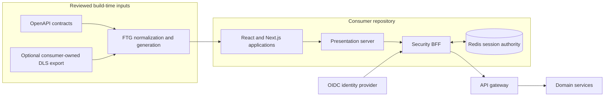

<div align="center">

# MP Frontend

**A contract-driven frontend foundation for React and Next.js product teams.**

Deterministic scaffolding, OpenAPI-backed presentation contracts, secure BFF sessions,
realtime recovery, internationalization, design-token boundaries, and finite AI workflows.

[](https://github.com/panahister/mpfrontend/actions/workflows/ci.yml)
[](LICENSE)
[](.node-version)
[](package.json)
[](#project-status)

[Architecture](docs/ARCHITECTURE.md) ·
[Getting started](docs/GETTING-STARTED.md) ·
[Design sources](packages/ftg-cli/DESIGN-SYNC.md) ·
[Implementation evidence](docs/IMPLEMENTATION-STATUS.md) ·
[Tiffin reference](https://github.com/panahister/mpfrontend-tiffin-reference) ·
[MP ecosystem](https://github.com/panahister/mpcore/blob/main/docs/architecture/ecosystem.md)

</div>

<picture>
  <source media="(prefers-color-scheme: dark)" srcset="docs/images/ecosystem-dark.svg">
  <source media="(prefers-color-scheme: light)" srcset="docs/images/ecosystem-light.svg">
  
</picture>

MP Frontend is a pnpm/Nx workspace for teams that want repeatable frontend architecture without
giving code generation ownership of their product. It keeps runtime trust boundaries, generated
artifacts, handwritten code, and consumer-owned design decisions explicit and independently testable.

This repository is the reusable foundation. Product behavior and brand assets belong in consumer
repositories. The public Tiffin reference demonstrates the complete integration against a real
food-delivery microservices system.

## Why MP Frontend

| Product concern | MP Frontend approach |
|---|---|
| Backend contracts drift from UI code | Normalize reviewed OpenAPI inputs and generate finite TypeScript models, validators, readers, and request adapters |
| Browser code reaches internal services | Keep tokens and internal origins behind a presentation server and Security BFF |
| Generated code overwrites product work | Separate generated ownership from handwritten adapters and fail on unexpected drift |
| Realtime reconnects lose authority or state | Bind admission, replay, snapshot recovery, leases, and revocation to explicit server-side contracts |
| Every product has a different design source | Support code-first products and consumer-owned Figma/DLS exports without publishing or mutating the source design |
| AI agents improvise architecture | Install a finite repository-scoped procedure catalog that calls deterministic tooling and preserves human review gates |

## Architecture at a glance



The browser receives product data and an opaque application session, not provider tokens or internal
service addresses. Authorization remains a backend responsibility; client-side access rules only
shape presentation. See [the architecture guide](docs/ARCHITECTURE.md) for trust boundaries, package
ownership, failure behavior, and non-goals.

## Package map

| Package | Responsibility |
|---|---|
| `@mpfrontend/ftg-cli` | Workspace lifecycle, contract capture, generation, verification, and design-source commands |
| `@mpfrontend/nx-plugin` | Repeatable Nx generators and project wiring |
| `@mpfrontend/ftg-core` | Finite contract normalization and request/response metadata |
| `@mpfrontend/ui` / `primitives` / `tokens` | Neutral UI composition and semantic styling foundations |
| `@mpfrontend/i18n` | Locale negotiation and direction-aware product primitives |
| `@mpfrontend/access-core` | Presentation-only capability and field/record visibility rules |
| `@mpfrontend/presentation-server` | Server-owned API mediation and realtime transport boundaries |
| `@mpfrontend/security-bff` | OIDC session lifecycle, encrypted Redis records, refresh coordination, and revocation |
| `@mpfrontend/realtime-core` | Ticketed realtime admission, reconnect, replay, and snapshot recovery |
| `@mpfrontend/ai-skills` | Eighteen finite, repository-scoped engineering procedures for Codex and Claude Code |

## Design-source model

MP Frontend does not require or publish a Figma Community file.

- `none` is the code-first path.
- `existing` attaches a product team's approved, normalized Figma/DLS export.

The CLI validates local artifacts and pins their identity and content hash. It does not ask for Figma
credentials, call the Figma API, mutate a design file, publish a library, or grant redistribution rights.

```bash
mpfrontend init --name my-product --directory ./my-product --design-source none --json
mpfrontend init --name my-product --directory ./my-product --design-source existing --json
mpfrontend design attach --directory ./my-product --source existing --binding design.binding.json --json
mpfrontend design status --directory ./my-product --json
```

The former public-template mode is deliberately refused in this MVP because no public MP Frontend DLS
is shipped. See [the design synchronization contract](packages/ftg-cli/DESIGN-SYNC.md).

## Verify the source

Prerequisites: Node.js `24.19.0`, pnpm `11.25.0`, and Docker for the Redis-backed session gate.

```bash
git clone https://github.com/panahister/mpfrontend.git
cd mpfrontend
pnpm install --frozen-lockfile
pnpm check --skip-nx-cache
pnpm pack:local
pnpm exec nx run distribution:consumer-check
```

The full workflow runs lint, type checking, unit and integration tests, package builds, immutable archive
checks, a fresh independent consumer, Redis-backed multi-replica session scenarios, dependency audit,
and deliberate negative controls. Passing source checks are evidence for this repository; they are not
a production certification for every consumer deployment.

## Repository map

```text
packages/                 reusable runtime and tooling packages
tools/distribution/       package, clean-consumer, and negative-control gates
docs/                     architecture, evidence, decisions, and runtime contracts
.github/workflows/        verification-only CI; no deployment or publication credentials
```

## Project status

MP Frontend is a public proof-of-concept source release. The source and independent-consumer gates pass,
but package-registry publication, semantic-version compatibility guarantees, production HA/TLS/key
custody, formal accessibility acceptance, and a neutral public design library are separate future gates.
The repository refuses to imply support for work that has not been run.

For the exact verified cohort, scenarios, and remaining limitations, read
[Implementation status](docs/IMPLEMENTATION-STATUS.md).

## Contributing and security

Read [CONTRIBUTING.md](CONTRIBUTING.md) before proposing a change. Report vulnerabilities privately as
described in [SECURITY.md](SECURITY.md). Participation is governed by
[CODE_OF_CONDUCT.md](CODE_OF_CONDUCT.md).

## License

Licensed under [Apache License 2.0](LICENSE).
