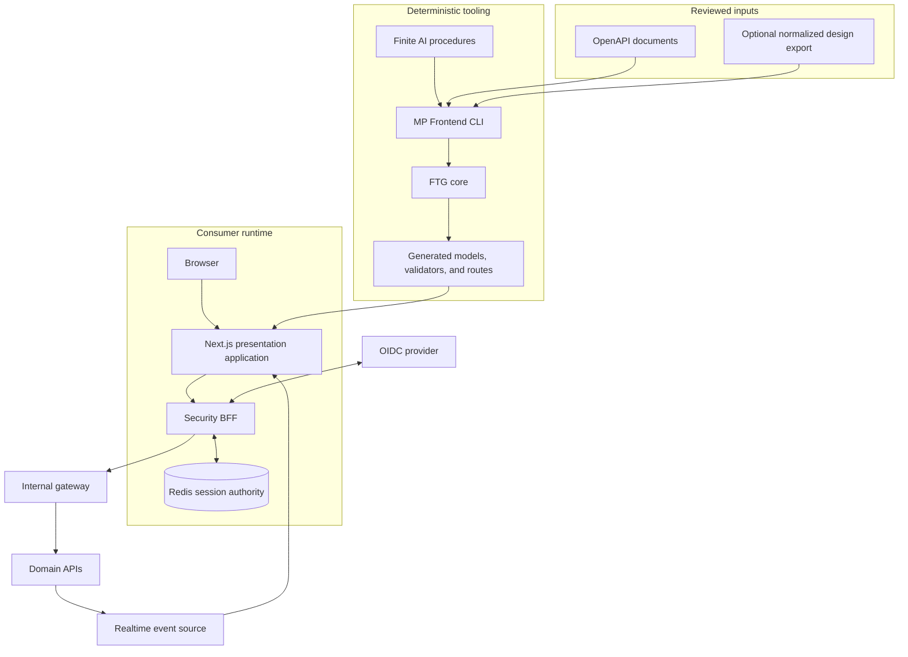
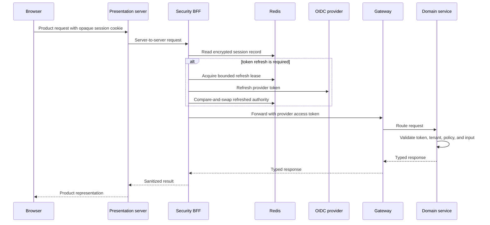
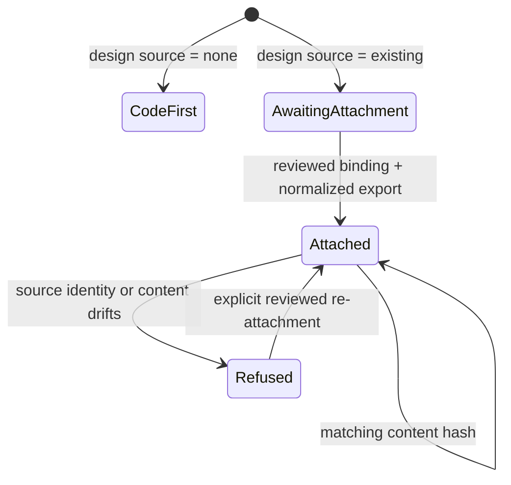

# Architecture

MP Frontend separates product-owned behavior from reusable frontend infrastructure. The architecture is
designed around four boundaries: reviewed build inputs, generated ownership, the browser trust boundary,
and server-side authority.

## System context

## Architectural rules

1. **The consumer owns product behavior.** Reusable packages contain domain-neutral mechanics. Business
   language, screens, workflows, brand assets, and product policy stay in the consumer repository.
2. **The server owns authority.** Client-side visibility rules improve the experience; they never
   authorize a request. The gateway and every domain service enforce access independently.
3. **Tokens do not enter browser JavaScript.** The Security BFF owns provider tokens and exposes an
   opaque, origin-bound application session.
4. **Generation is finite and reviewable.** The CLI accepts explicit contract profiles, writes only its
   declared ownership surface, and refuses unsupported ambiguity or drift.
5. **Design integration is consumer-owned.** The CLI validates reviewed local exports. It does not read
   from or write to a remote design tool.
6. **Failure is a contract.** Session-store outages fail closed, replay is bounded, and stale authority
   cannot publish a refreshed session.
7. **AI procedures do not bypass tooling.** Repository-scoped procedures choose and sequence deterministic
   commands; they preserve human approval and refusal boundaries.

## Runtime trust boundaries

The BFF is not the only authorization wall. A compromised or misconfigured gateway must not turn an
internal service into an unauthenticated API. Likewise, a client-side capability snapshot is a display
projection, not a policy decision point.

## Build-time contract flow

1. A product approves an OpenAPI source and captures an immutable local revision.
2. FTG normalizes only supported request and response profiles.
3. Generators write models, runtime validators, presentation readers, and mutation adapters into declared
   generated locations.
4. Handwritten feature code imports generated contracts through stable consumer adapters.
5. CI regenerates and fails when authored output has drifted or an unsupported contract shape appears.

The tool intentionally distinguishes required JSON, optional JSON, bodyless requests, typed success
responses, and explicit empty responses. It does not guess product semantics from an arbitrary schema.

## Design-source lifecycle

The binding records only the local normalized contract required for deterministic work. Private Figma
keys, credentials, raw design files, and redistribution rights are outside this repository's contract.

## Package dependency direction

- `primitives`, `tokens`, `i18n`, `access-core`, and `ftg-core` are low-level, domain-neutral libraries.
- `ui` composes primitives and semantic styling but does not own a product theme.
- `presentation-server`, `security-bff`, and `realtime-core` own server/runtime boundaries.
- `ftg-cli` and `nx-plugin` operate on repositories; runtime packages do not depend on them.
- `ai-skills` describes bounded procedures and invokes supported tooling; it does not become an alternate
  generator.

Circular dependencies and imports from a consumer back into the foundation are architectural defects.

## Realtime consistency model

Realtime connections require bounded admission. A server issues a short-lived ticket, enforces quotas,
tracks a single authority generation, and coordinates reconnect/replay with a snapshot. Recovery waits
for the requested snapshot before publishing a resumed state. Revocation and stale-authority fences take
precedence over convenience: when authority cannot be established, the connection closes and the product
returns to a recoverable signed-out or retry state.

## Deployment model

The packages are deployment-neutral. A reference deployment uses independently deployable Next.js
applications and BFFs, a shared highly available Redis boundary, an OIDC provider, an internal gateway,
and domain services. This source release has local multi-replica Redis evidence. Kubernetes topology,
production TLS and key custody, regional failover, and load acceptance are not claimed.

## Non-goals

- Replacing backend authorization.
- Owning a product's domain model or UI composition.
- Scraping or mutating Figma.
- Accepting arbitrary OpenAPI semantics through inference.
- Hiding generated drift or overwriting handwritten files.
- Claiming production readiness from a local build alone.

## Evidence

The exact package cohort, positive and negative controls, reference applications, and remaining work are
maintained in [IMPLEMENTATION-STATUS.md](IMPLEMENTATION-STATUS.md). Architectural decisions are recorded
under [decisions](decisions/).
