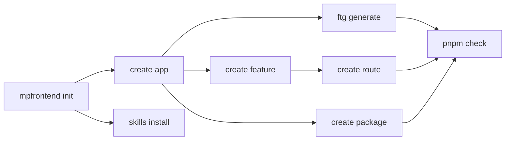

# CLI guide

One guide to every command of the MP Frontend tooling. The package `@mpfrontend/ftg-cli` installs one
executable under two names, `mpfrontend` and `ftg`; both accept every command below. The Nx generators of
`@mpfrontend/nx-plugin` produce the same files as the matching `mpfrontend create` command.

Run every command from the workspace root with `pnpm exec`. Add `--json` where it is accepted for
machine-readable output. A command that would write supports `--dry-run`, which lists what it would
write and writes nothing. No command overwrites an existing file, initializes Git, installs packages,
deploys, publishes or reads or writes Figma.

Exit codes: `0` success; `2` invalid input, an unknown option or an existing destination; `3` drift, a
stale state or a failed check; `4` a path, ownership or concurrency violation.

## The order of work

## Workspace

### `mpfrontend init`

`mpfrontend init --name <name> --directory <new-directory> [--design-source none|existing] [--dry-run] [--json]`

- **Does:** creates a new Nx and pnpm workspace with the quality profile (`eslint.config.mjs`,
  `prettier.config.mjs`, `.prettierignore`, the `check` script, `tools/ci/check.sh` and a GitHub Actions
  workflow), `CODEOWNERS` with placeholder owners, `.agents/skills/README.md` for the workspace's own
  skills, `AGENTS.md`, `CLAUDE.md`, `README.md`, `contracts/README.md` and the design-source record.
- **When:** once, to start a consumer repository.
- **Writes:** only inside the new directory.
- **Refuses:** an existing destination, including an empty directory or a symlink; a name outside
  `^[a-z][a-z0-9-]{1,48}$`; a design source other than `none` or `existing`.

### `mpfrontend --version`

Prints the version of the installed CLI. It refuses any other argument beside it.

## Scaffolding

Every generator below validates its names (`^[a-z][a-z0-9-]{1,48}$`), refuses an existing destination,
and formats what it writes with the workspace's own Prettier configuration when the workspace has one.

### `mpfrontend create app` and `nx g @mpfrontend/nx-plugin:application`

`mpfrontend create app --name <name> --directory apps/<name> [--dry-run]`

- **Does:** creates a Next.js app with the quality targets (`format`, `format:check`, `lint`, `test`),
  `ftg-generate`, `generated-check`, `build`, `typecheck`, `dev` and `start`; a catalog example made by the
  feature and route generators (a list route `/catalog` and a detail route `/catalog/[position]`); a
  `preferences` feature; `.env.example` with variable names only; and `docs/overview.md` and
  `docs/api-contracts.md`.
- **When:** for each independently deployable app.
- **Writes:** only inside the new app directory.
- **Refuses:** an existing destination; an invalid name.

### `mpfrontend create feature` and `nx g @mpfrontend/nx-plugin:feature`

`mpfrontend create feature --app <app-directory> --name <feature> [--resource <ftg-resource>] [--dry-run] [--json]`

- **Does:** creates `src/features/<feature>/` with `ui/`, `model/`, `hooks/`, `api/`, `utils/` and an
  `index.ts` public entry, each with a small working file and tests. Without `--resource` it is a screen
  feature: a view that emits intent, a hook that holds the workflow state, a model of its transitions, a
  cancellable and time-bounded request boundary and a helper; its request is unbound until the app binds
  it to a generated contract adapter. With `--resource` it is a list feature over a read that the app's
  `ftg.config.json` selects: a URL-driven list and detail, the shared entity in `src/entities/<resource>/`
  and the server boundary in `src/api/server/<resource>.ts`.
- **When:** for each new user workflow of an app.
- **Writes:** the feature directory; the entity and the server boundary only when they do not exist yet.
  An existing entity or boundary is kept and listed under `kept`.
- **Refuses:** an existing feature directory; an unknown app; a resource that `ftg.config.json` does not
  select; a list feature in an app without `src/config/app.ts` and `src/config/server.ts`.

Code outside the feature imports only its `index.ts`; the lint rule `mpfrontend/public-entry` refuses a
deeper import, and the same rule applies to `src/entities/<entity>/`.

### `mpfrontend create route` and `nx g @mpfrontend/nx-plugin:route`

`mpfrontend create route --app <app-directory> --path <route> --feature <feature> [--screen <Export>] [--dry-run] [--json]`

- **Does:** creates one thin `src/app/<route>/page.tsx` that renders a screen of a feature through the
  feature's public entry and passes the route's base path. The screen defaults to `<Feature>Screen`. A
  detail view is a child route with a dynamic segment, for example `orders/[position]`, so that a screen
  can be linked and refreshed.
- **When:** for each screen; tabs and details are child routes or URL state, not component state.
- **Writes:** that one file.
- **Refuses:** a path segment outside lower-case words or `[param]`, a path under `api/`, a repeated
  parameter; an unknown feature or a screen that its `index.ts` does not export; an existing page or
  route handler at the path.

### `mpfrontend create package` and `nx g @mpfrontend/nx-plugin:package`

`mpfrontend create package --name <name> [--directory packages/<name>] [--runtime universal|client|server] [--dry-run] [--json]`

- **Does:** creates a shared package `@<workspace>/<name>` with the tags `type:package`, `scope:shared`
  and `runtime:<runtime>`, a public entry in `src/index.ts` built to `dist/`, and the targets `build`,
  `typecheck`, `format`, `format:check`, `lint` and `test`.
- **When:** when two apps need the same code; never copy code between apps.
- **Writes:** only the new package directory. An app uses the package by adding
  `"@<workspace>/<name>": "workspace:*"` to its own `package.json` and running `pnpm install`.
- **Refuses:** an existing destination; a directory other than `packages/<name>`; a runtime other than
  the three above; a workspace without a root `package.json`.

## Contracts

### `ftg generate`

`ftg generate --config apps/<app>/ftg.config.json [--dry-run] [--json]`

- **Does:** reads the captured OpenAPI contract and writes models, standalone validators and field
  metadata of the selected reads and requests into the configured output (the template uses
  `src/api/generated/<contract>`; an existing app's feature-local output stays valid).
- **When:** after the captured contract or `ftg.config.json` changes; the app `build` target runs it.
- **Writes:** only its declared output files and their manifest.
- **Refuses:** an unsupported or ambiguous contract profile; external references; an output outside the
  configuration root or through a symlink; an authored file in the output; a concurrent writer.

### `ftg check`

`ftg check --config apps/<app>/ftg.config.json [--json]`

- **Does:** regenerates in memory and compares with the checked-in output.
- **When:** in every review and CI run; the `generated-check` target runs it.
- **Writes:** nothing.
- **Refuses:** drift (exit `3`), and the same inputs as `ftg generate`.

## Design source

### `mpfrontend design attach` and `mpfrontend design status`

`mpfrontend design attach --directory <workspace> --source existing --binding <file> [--dry-run] [--json]`
attaches a consumer-owned design binding to a workspace created with `--design-source existing`, or to a
code-first workspace later. It writes only `.mpfrontend/design-source.json` and refuses a changed source
once attached, a traversing path and a symlink. `mpfrontend design status --directory <workspace>
[--json]` revalidates the recorded choice and writes nothing.

### Design lifecycle commands

| Command | Does | Writes | Refuses |
|---|---|---|---|
| `design import --binding <file> --snapshot <export>` | Stores a reviewed normalized export as an immutable candidate | The candidate under the binding's state directory | A source identity that differs from the binding; an unsupported export |
| `design validate --binding <file> --candidate <hash>` | Validates a candidate against the binding | Nothing | Unknown mappings, unresolved behavior or rights |
| `design diff --binding <file> --candidate <hash>` | Lists token and component changes against the baseline | Nothing | A missing candidate |
| `design plan --binding <file> --candidate <hash>` | Writes a plan bound to the candidate, the binding and the current outputs | The plan | A stale or unresolved candidate |
| `design apply --plan <file>` | Writes `tokens.gen.css`, `components.gen.json` and an ownership receipt | Those owned outputs | A stale plan; an unowned output collision |
| `design accept --plan <file> --evidence <file>` | Records the reviewed baseline from attested evidence | The baseline | Failed or drifted evidence artifacts |
| `design check --binding <file>` | Verifies outputs against the accepted baseline | Nothing | No accepted baseline; drift |

Run them in that order when a reviewed design export changes; see the
[design synchronization contract](../packages/ftg-cli/DESIGN-SYNC.md). They never call or change Figma.

## Agent skills

### `mpfrontend skills list|install|update|check`

`mpfrontend skills install [--directory <repository>] [--for codex|claude|both] [--profile base|design] [--dry-run] [--json]`

- **Does:** `list` shows the eighteen procedures; `install` writes the fourteen base procedures (or all
  eighteen with `--profile design`) to `.agents/skills/mpfrontend-*` and `.claude/skills/mpfrontend-*`
  and records their hashes in `.mpfrontend/skills-lock.json`; `update` brings installed procedures to the
  installed CLI's versions; `check` verifies the installed files against the lock and the catalog.
- **When:** `install` once when agent workflows are wanted; `update` with each cohort upgrade; `check`
  in review and CI.
- **Writes:** only `mpfrontend-*` folders and the lock. The workspace's own skills live beside them
  under another prefix, as `.agents/skills/README.md` describes, and are never read, changed or removed.
- **Refuses:** a locally modified or unowned `mpfrontend-*` file; a folder under the reserved
  `mpfrontend-` prefix that is not in the catalog; a symlinked path; a concurrent installation.

## Workspace targets

The generated workspace adds these scripts and targets; they are not CLI commands but they are what the
CLI prepares.

| Command | Does |
|---|---|
| `pnpm check` | The format check, then `lint`, `typecheck`, `test`, `build` and `generated-check` of every project |
| `pnpm format` / `pnpm format:check` | Formats or checks the whole workspace |
| `pnpm exec nx run <project>:<target>` | One target: `format`, `format:check`, `lint`, `test`, `typecheck`, `build`, `ftg-generate`, `generated-check` |
| `sh tools/ci/check.sh` | The CI-neutral gate: a frozen install, then the uncached check |
