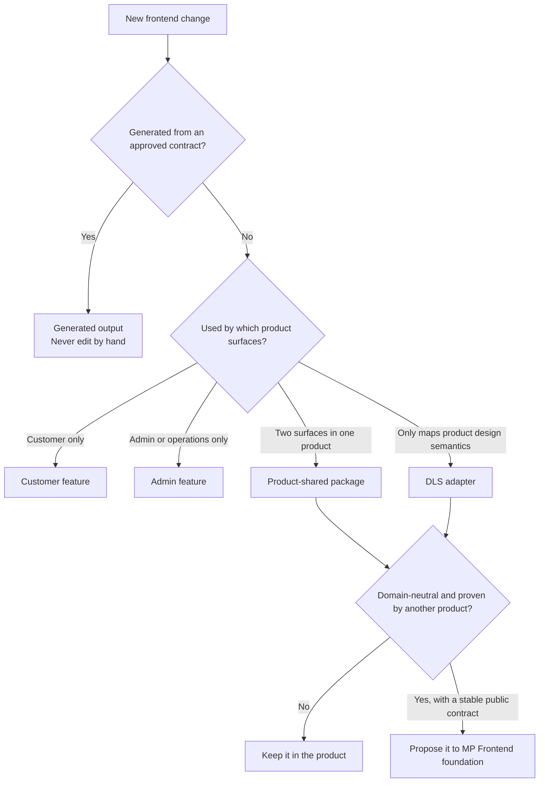

# Frontend engineering conventions

This document is the default decision contract for product developers, reviewers, and coding agents that
use MP Frontend. It answers two recurring questions:

1. where a change belongs; and
2. how an API-backed feature moves from contract to verified product behavior.

These are defaults, not permission to invent a missing product decision. Record an approved exception in
the consumer repository before implementing it.

## The placement decision



| Destination | Put it here when | Never put here |
|---|---|---|
| Customer application | The route, copy, workflow, state, or composition exists only for an end-customer journey | Admin policy, reusable foundation behavior, provider credentials |
| Admin application | The behavior exists only for an operator, manager, courier, support, or governance journey | Customer presentation, cross-product primitives |
| Product-shared package | At least two product surfaces use the same product concept and the shared API is smaller than the duplicated implementation | A single caller, route composition, framework candidates, unrelated helpers |
| DLS adapter | Product tokens, typography, assets, direction, or component semantics are mapped onto foundation primitives | API calls, authorization policy, workflows, business state |
| BFF or presentation server | Session, token, trusted upstream, response validation, or server-only composition crosses a trust boundary | Visual state, browser-owned interaction, business authority |
| Generated output | The checked-in contract and finite generator configuration own the file | Handwritten fixes, product copy, UI state, credentials |
| MP Frontend foundation | The capability is domain-neutral, has a stable contract, and is demonstrated by at least two independent product shapes or an explicit platform requirement | Product vocabulary, brand, routes, roles, endpoint choices, one-product convenience |

The default is to keep a capability in the product. Promotion into foundation is a compatibility and
maintenance commitment, not a refactoring shortcut.

## Separation of concerns

Use four collaborating parts for an API-backed feature. A small feature may keep them in one feature
folder, but it must preserve the responsibilities.

| Part | Owns | Must not own |
|---|---|---|
| View | Rendering, accessibility semantics, local input state, and emitting user intent | Fetching, token access, response parsing, authorization decisions, business invariants |
| Feature model or controller | Workflow state, use-case orchestration, optimistic presentation, and mapping technical outcomes to product states | Provider credentials, raw transport policy, reusable visual primitives |
| Contract boundary | Generated request/response types and validators plus a small handwritten adapter | Product copy, navigation, component state |
| Server adapter | Session lookup, CSRF/idempotency forwarding, trusted upstream selection, timeouts, and response validation | UI behavior or pretending that frontend visibility is backend authorization |

### When logic leaves a component

Extract logic when any answer below is yes:

| Question | Destination |
|---|---|
| Can the rule be tested without rendering? | A pure function in the feature model |
| Does it coordinate more than one request or state transition? | A feature controller or use-case function |
| Does it parse or validate an external payload? | The contract boundary, preferably generated |
| Does it touch a token, trusted URL, cookie, or service credential? | A server-only adapter or BFF |
| Is it only formatting a product value for display? | A pure product presentation function |
| Is it only visual behavior with no product vocabulary? | A foundation primitive only after the promotion test above |

Do not extract a one-line expression merely to reduce component line count. Extract because ownership,
testability, trust, or reuse becomes clearer.

### Preferred shape

```tsx
function OrderActions({order, onCancel}: Props) {
  const canCancel = cancellationPresentation(order.status);
  return canCancel.visible
    ? <Button disabled={canCancel.disabled} onClick={() => onCancel(order.id)}>Cancel order</Button>
    : null;
}
```

The view renders product state and emits intent. A feature controller performs the request, validates the
response, refreshes dependent reads, and maps expected failures to localized feedback. The backend still
owns the real cancellation rule and authorization.

Avoid a component that reads provider tokens, constructs an internal service URL, calls `fetch`, accepts
any successful JSON shape, decides whether the actor is authorized, and renders the result. That combines
five owners and makes both security and testing ambiguous.

## Workspace and feature layout

The generators write this layout; the [CLI guide](CLI-GUIDE.md) lists what each one writes and refuses.

```text
apps/<app>/
├── docs/                      overview.md, api-contracts.md; business-rules.md and adr/ when needed
├── .env.example               variable names only, never values
└── src/
    ├── app/                   thin routes, layouts and route handlers; one route per screen
    ├── features/<feature>/    one user workflow
    │   ├── index.ts           the public entry; code outside the feature imports only this
    │   ├── ui/                views: render state, emit intent
    │   ├── model/             types, validation, constants and workflow rules
    │   ├── hooks/             feature-specific React state and orchestration
    │   ├── api/               feature requests and persistence
    │   └── utils/             small pure helpers used only by this feature
    ├── entities/<entity>/     types and rules shared by the features of one entity, with an index.ts
    ├── api/generated/         generated contracts; never edited by hand
    ├── api/server/            the hand-written server boundary beside them
    ├── config/                typed, validated configuration
    └── theme/                 the theme registry
packages/<name>/               code that two apps need: tags, a public entry and the quality targets
```

- `mpfrontend create feature` writes a feature; with `--resource` it writes a list and detail over one
  generated read, its entity and its server boundary. `mpfrontend create route` writes one thin page per
  screen. `mpfrontend create package` writes a shared package. Each is also an Nx generator of
  `@mpfrontend/nx-plugin`.
- Every screen is a route that can be linked and refreshed. Tabs and detail views are child routes or URL
  state; a page number or a search lives in the URL, not in component state.
- The lint rule `mpfrontend/public-entry` refuses an import into another feature's or entity's folders.
- Code that two apps need is a shared package with `type:package` and `scope:shared` tags; copying it
  between apps is never the answer. Lint refuses an import from one app into another.
- Tests sit beside the code they test (`*.test.ts`, `*.test.tsx`); app-level integration tests go in
  `src/tests/`.

## Text and catalogs

Every user-visible text is a catalog message. An app keeps its app-wide catalog set in
`src/i18n/messages/<locale>.ts`, and each feature its own set in `model/messages/<locale>.ts`; the default
locale's catalog defines the keys and, through its literal types, the parameters of each message, and every
other locale has the same keys. Messages use ICU MessageFormat with named parameters, so each locale
places the values; never join a translated message to other text or a value. `pnpm check` runs
`catalog-check`, which fails on a key missing in a locale, a key that no code uses, a key that code uses
and the base does not define, and a parameter that differs between locales, and lint fails on literal text in JSX. Free text that users wrote is shown as it
is, never translated.

MP Frontend ships English only, and no other language belongs in it. A product adds its own locales, left
to right or right to left, in its own repository: it registers each one with its direction in the app's
registry (`src/config/app.ts`) and adds a `messages/<code>.ts` catalog to every set; it may also make its
own locale the default and only locale. The document's `lang` and `dir` follow the registry, and layout
uses logical properties (start and end), never left and right.

## State, effects, and data access

- Derive values during render when they follow from props or state; do not synchronize derived values with
  an effect. This follows React's guidance in *You Might Not Need an Effect*.
- Keep state at the lowest common owner of the views that coordinate it. Do not create a global store to
  avoid passing a small, stable feature value.
- Use an effect only to synchronize with an external system. Event-driven work belongs in the event path,
  not in an effect that watches a flag.
- Keep server data authoritative. Optimistic UI is a reversible presentation choice and must reconcile
  with a validated server result.
- Never infer authorization from a hidden control. The server decides; capability-driven UI only explains
  and presents that decision.
- Preserve cancellation through every asynchronous layer and place explicit time bounds at network
  boundaries.
- Treat external data as `unknown` until the generated or approved handwritten boundary validates it.

## Standard API-backed feature path


1. **Start with an approved API contract.** Confirm operation id, method, path, request-body profile,
   success status, response schema, failure identities, authorization, and idempotency behavior.
2. **Update the captured contract.** The consumer repository owns an immutable, reviewable OpenAPI input.
   Do not generate from an unpinned live endpoint during a normal feature change.
3. **Select only the operations the app uses.** Add the read or request to that app's `ftg.config.json`.
   Choose required JSON, optional JSON, or bodyless behavior explicitly.
4. **Generate; never hand-edit output.** Run the app's `ftg-generate` target and inspect both the generated
   manifest and diff. A generator defect is repaired in the generator.
5. **Bind at the trusted boundary.** The handwritten boundary selects the generated contract, validates
   requests before forwarding and validates successful status plus response before returning it.
6. **Implement product behavior.** Put orchestration and product state in the correct feature; keep the
   view focused on rendering and intent.
7. **Test the contract and the experience.** Cover valid and invalid payloads, expected failures,
   cancellation, accessibility, localization, and the state transition the user sees.
8. **Run focused targets first.** Use the app's format, lint, typecheck, test, and build targets for fast
   feedback.
9. **Run the drift gate.** `generated-check` must prove that checked-in output matches the contract and
   configuration.
10. **Run the repository gate and a real mode.** Complete the uncached gate, then exercise the feature in
    the consumer's documented local workflow. Report exactly what ran.

Typical commands in a consumer Nx workspace are:

```bash
pnpm exec nx run <app>:ftg-generate
pnpm exec nx run <app>:format
pnpm exec nx run <app>:format:check --skip-nx-cache
pnpm exec nx run <app>:test --skip-nx-cache
pnpm exec nx run <app>:lint --skip-nx-cache
pnpm exec nx run <app>:typecheck --skip-nx-cache
pnpm exec nx run <app>:build --skip-nx-cache
pnpm exec nx run <app>:generated-check --skip-nx-cache
pnpm check --skip-nx-cache
```

`mpfrontend init` and `mpfrontend create app` write every target above. Use the consumer repository's
exact project names and live workflow. A passing generation command alone does not prove the feature.

## Quality profile

A generated workspace takes its formatter, lint and TypeScript configuration from
`@mpfrontend/workspace-config`, upgraded with the MP Frontend cohort. The root `eslint.config.mjs` and
`prettier.config.mjs` re-export the shared profile; an app or a package appends only its own additions.
`pnpm check` runs the format check, then lint, typecheck, test, build, generated-check and catalog-check of every
project. `tools/ci/check.sh` runs a frozen install and the uncached check in any CI.

| Rule | What fails lint |
|---|---|
| Module boundaries | An app importing another app; a shared package importing an app; a dependency that crosses the `type:*`, `scope:*`, or `runtime:*` tag constraints |
| No raw colour | Hex, `rgb()`, `rgba()`, `hsl()`, `hsla()`, and named colours in TS, TSX, and CSS, and Tailwind palette or arbitrary colour utilities such as `bg-[#123456]`, outside the theme files |
| No hand-written CSS | A stylesheet outside the theme layer and the one global entry; class or id rules in the global entry; inline style objects other than CSS custom properties |
| Logical properties | Physical left and right in class names (`ml-2`, `left-0`, `border-l`, `text-right`), inline styles (`marginLeft`) and CSS (`margin-left`, `text-align: left`), unless the workspace allows the value with a reason; use start and end forms |

Colours come from design tokens (`var(--mp-*)`) and the theme file; layout comes from framework
components and utility classes. Every app is framed by `@mpfrontend/app-layout` (skip link, header,
navigation slot, page frame), and its only stylesheets are the global entry `src/app/globals.css`
(imports and base element rules) and the theme file `src/theme/theme.css`, which loads after the neutral
token fallback and holds the app's token values or imports the generated tokens of an attached design
source. The allowed paths and tag constraints are options of the shared
configuration, not edits to it. Fix the code rather than weakening a rule to make the check pass.

## Generated and handwritten ownership

| Change needed | Edit | Then |
|---|---|---|
| API shape changed | Captured OpenAPI contract | Regenerate and review compatibility |
| App starts using an existing operation | App `ftg.config.json` | Regenerate and add boundary tests |
| Generated output is wrong for every consumer | Generator source in MP Frontend | Add a failing generator regression and prove an independent consumer |
| Product flow or copy changed | Product feature or adapter | Run focused product tests; do not regenerate unrelated files |
| Design semantics changed | Consumer DLS adapter or reviewed token source | Run theme/design verification; do not add business logic to the adapter |

Generated files are checked in so drift and review are possible. They are output, not an extension point.

## Review checklist for developers and agents

- [ ] The product owner and surface are named.
- [ ] The placement decision follows the table, or an approved exception is recorded.
- [ ] UI renders state and emits intent; testable workflow logic is outside the component.
- [ ] Trusted session and upstream behavior stays server-side.
- [ ] No generated file was edited by hand.
- [ ] Contract method, path, body profile, success status, and response are validated.
- [ ] Backend authorization is not replaced by UI visibility.
- [ ] Expected failure, loading, empty, success, and retry states are deliberate.
- [ ] Accessibility, localization, direction, and cancellation are covered where applicable.
- [ ] Focused targets, generated drift, the uncached repository gate, and a real local mode are reported.
- [ ] A product-specific workaround was not placed in foundation.

An agent must stop and ask when the business owner, API contract, permission model, or target surface is
ambiguous. It must not choose a business rule merely because one implementation is convenient.

## Sources and why they apply

| Source | Convention used here |
|---|---|
| React, [Thinking in React](https://react.dev/learn/thinking-in-react) and [You Might Not Need an Effect](https://react.dev/learn/you-might-not-need-an-effect) | Component decomposition, one-way data flow, derived state, and effect discipline |
| Next.js, [Server and Client Components](https://nextjs.org/docs/app/getting-started/server-and-client-components) | Explicit server/client and trust boundaries |
| Nx, [Enforce Module Boundaries](https://nx.dev/features/enforce-module-boundaries) | Dependency direction and tag-enforced repository boundaries |
| Feature-Sliced Design, [Public API](https://feature-sliced.design/docs/reference/public-api) | One public entry per feature or entity, with deeper imports refused |
| ESLint, [Configuration Files](https://eslint.org/docs/latest/use/configure/configuration-files), and [Prettier](https://prettier.io/docs/) | One shared flat configuration and formatter profile that each project extends |
| Testing Library, [Guiding Principles](https://testing-library.com/docs/guiding-principles) | Tests emphasize observable behavior over implementation detail |
| Unicode, [ICU MessageFormat](https://unicode-org.github.io/icu/userguide/format_parse/messages/) | Messages with named parameters, plural and select rules per locale, placed by each translation |
| OpenAPI Initiative, [Specification](https://spec.openapis.org/oas/latest.html) | The captured API description is a reviewed contract input |
| Robert C. Martin, *Clean Architecture* (2017) | Dependencies point toward stable policy rather than transport and frameworks |
| MP Frontend [Architecture](ARCHITECTURE.md) | Product/foundation ownership, browser/BFF trust, generation, and failure model |

