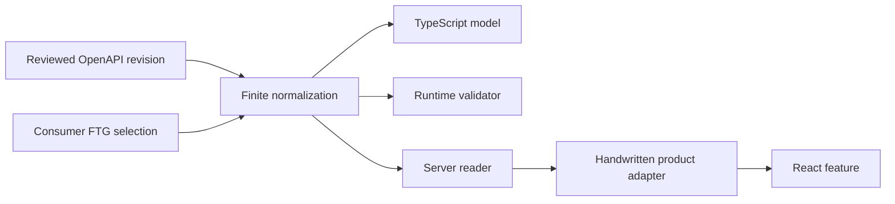

# Generated read contracts

MP Frontend generates presentation-safe readers only for operations selected by a consumer-owned FTG
configuration. It does not expose every OpenAPI operation automatically.

## Flow

The generated reader runs on the server side. It validates the backend response before returning the
selected projection to product code. Internal gateway origins and provider tokens remain outside browser
JavaScript.

## Ownership

- Backend teams own OpenAPI response semantics.
- The consumer owns which operations and fields enter the presentation model.
- FTG owns generated models, validators, and reader transport glue.
- Product features own composition, empty/loading/error experience, and business language.
- Backend authorization remains authoritative; generated readers do not grant access.

## Refusal behavior

Generation fails on unsupported unions, ambiguous success responses, unbounded schemas, invalid selected
paths, unknown formats, or drift in generated ownership. A consumer must add an explicit handwritten
adapter or extend the finite profile with tests; it must not weaken validation to accept arbitrary data.

## Current reference scope

The two reference applications select anonymous catalog/menu reads, seven protected customer reads, and
twelve role-aware operations reads. The customer and operations features exercise generated validation,
server-only transport, localized failure mapping, and loading/empty states. This is evidence for those
selected operations, not a claim of complete OpenAPI coverage.
