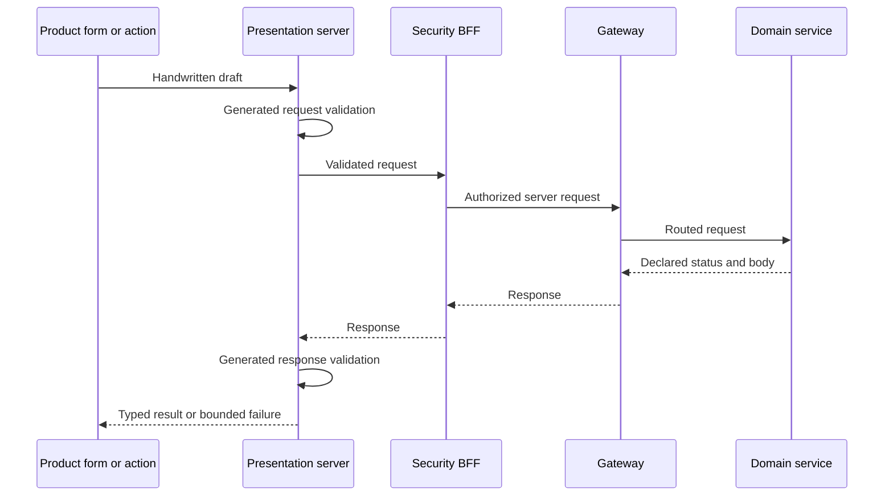

# Generated request and response profiles

Request generation is deliberately finite. Each selected operation declares the request body and success
response profile instead of asking a generator to guess from an arbitrary OpenAPI document.

## Request profiles

| Profile | Meaning |
|---|---|
| `required-json` | A non-empty JSON body is required and validated against a closed schema |
| `optional-json` | No body, JSON `null`, and a validated closed JSON object are distinct valid values |
| `none` | The request has no body; payload bytes and content type are refused |

Scalar HTML inputs are adapted explicitly into the selected JSON model. Multipart and streaming payloads
require a purpose-built transport and are not silently forced through JSON generation.

## Response profiles

| Profile | Meaning |
|---|---|
| typed success | The declared success status has a runtime-validated response body |
| explicit empty success | The declared status, such as `204`, must contain no response body |

Unexpected status codes, content types, bodies, and schema violations are mapped to bounded server-side
failures before product code receives a result.

## Runtime path

CSRF/origin checks, session authority, backend authorization, idempotency, and domain invariants remain
independent controls. Schema validation does not replace them.

## Current reference scope

The current consumer cohort selects twenty-four mutations: sixteen required-JSON requests, six bodyless
requests, and two optional-JSON requests. It also includes typed `200`/`201`/`202` results and an explicit
empty `204` result. The packed consumer and reference applications verify request and response refusal,
generated drift, scalar adaptation, and preservation of handwritten product files.
